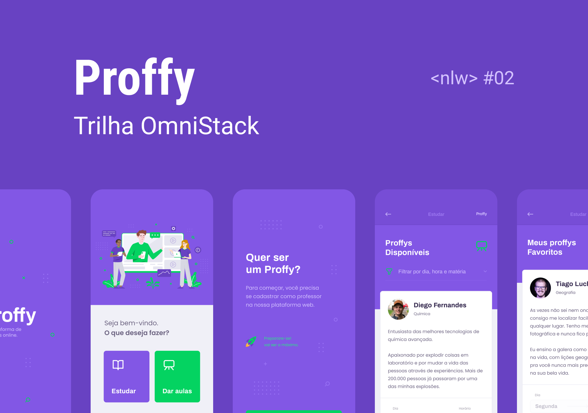

# Proffy

### Your online study platform. Connects people that want to learn with people that want to teach.

#### Status: Finished

[About](#about) | [Installation](#installation) | [Development setup](#development-setup) | [Technologies](#technologies) | [License](#license)



## About

The Proffy app is an online study platform which connects students with teachers to take online classes. This application was developed during the 2nd Next Level Week, an event held by [RocketSeat](https://rocketseat.com.br/).

## Installation

To run this project you will need to have the following tools:

### Node.js

Node.js is a JavaScript runtime environment and the base for this application.

#### Linux (Ubuntu based distributions):
```bash
curl -sL https://deb.nodesource.com/setup_12.x | sudo -E bash -
sudo apt install -y nodejs
```
#### Linux (Debian based distributions):
```bash
curl -sL https://deb.nodesource.com/setup_12.x | bash -
apt install -y nodejs
```
#### macOS (using [Homebrew](https://brew.sh/)):
```bash
brew install node@12
```
#### Windows (using [Chocolatey](https://chocolatey.org/)):
```powershell
cinst nodejs-lts
```
To verify if the installation was successful, just type `node -v` to get the Node.js version and `npm -v` to get the npm version.

### Yarn package manager (optional)

You can use the `yarn` package manager as an alternative to `npm`.

#### Linux (Ubuntu/Debian based distributions):

Configuring the repository:
```bash
curl -sS https://dl.yarnpkg.com/debian/pubkey.gpg | sudo apt-key add -
echo "deb https://dl.yarnpkg.com/debian/ stable main" | sudo tee /etc/apt/sources.list.d/yarn.list
```

Installing Yarn:
```bash
sudo apt update
sudo apt install --no-install-recommends yarn
```

Add the following to your `.bashrc` or `.zshrc` file:
```bash
export PATH="$PATH:`yarn global bin`"
```

#### macOS (using [Homebrew](https://brew.sh/)):

Installing Yarn:
```bash
brew install yarn
```

Add the following to your `.bashrc` or `.zshrc` file:
```bash
export PATH="$PATH:`yarn global bin`"
```

#### Windows (using [Chocolatey](https://chocolatey.org/)):
```powershell
cinst yarn
```

Chosse the option `[A]ll - yes to all`.

Reopen the terminal or run `source ~/.bashrc` or `source ~/.zshrc` for the changes to take effect. To verify if the installation was successful, just type `yarn --version` to get the Yarn version.

### Expo

With Node.js installed, run the following command to install Expo:

| npm                           |    | yarn                     |
|:------------------------------|:---|:-------------------------|
|`npm install expo-cli --global`| or |`yarn global add expo-cli`|

To verify if the installation was successful, just type `expo --version` to get the Expo version.

## Development setup

To run the application and/or start working on it, you first have to set up the development environment.

### Installing dependencies

In the folders `server`, `web` and `mobile`, execute the following command to install all dependencies of the project:

| npm         |    | yarn         |
|:------------|:---|:-------------|
|`npm install`| or |`yarn install`|

### Setting up the database

To create or update the database, it's necessary to run the following command in the `server` folder:

| npm                  |    | yarn              |
|:---------------------|:---|:------------------|
|`npm run knex:migrate`| or |`yarn knex:migrate`|

### Running the server

To run the server, just execute the following command in the `server` folder:

| npm       |    | yarn       |
|:----------|:---|:-----------|
|`npm start`| or |`yarn start`|

### Running the web client

To run the web client execute the following command in the `web` folder and a browser window will open with the web client running:

| npm       |    | yarn       |
|:----------|:---|:-----------|
|`npm start`| or |`yarn start`|

### Running the mobile app

For the mobile app it's necessary to execute the following command in the `mobile` folder:

| npm       |    | yarn       |
|:----------|:---|:-----------|
|`npm start`| or |`yarn start`|

You must read the QR Code that popped up in a browser window (it's also available at the terminal) with the Expo app in your phone and wait for the app to load. If you are using an Android emulator with Android Studio or an iOS emulator with XCode, you can click on the `Run on Android device/emulator` or `Run on iOS emulator` in the browser window and the app will start to load.

The Expo app is available for Android: 
```
play.google.com/store/apps/details?id=host.exp.exponent
```
and iOS:
```
apps.apple.com/app/expo-client/id982107779
```
## Technologies

- Server ([package.json](server/package.json)): [NodeJS](https://nodejs.org/en/), [Typescript](https://www.typescriptlang.org/)
- Web ([package.json](web/package.json)): [React](https://reactjs.org/), [Typescript](https://www.typescriptlang.org/)
- Mobile ([package.json](mobile/package.json)): [React Native](https://www.reactnative.com/), [Typescript](https://www.typescriptlang.org/)

## License

This project is licensed under the MIT License - see the [LICENSE](LICENSE) file for details.
